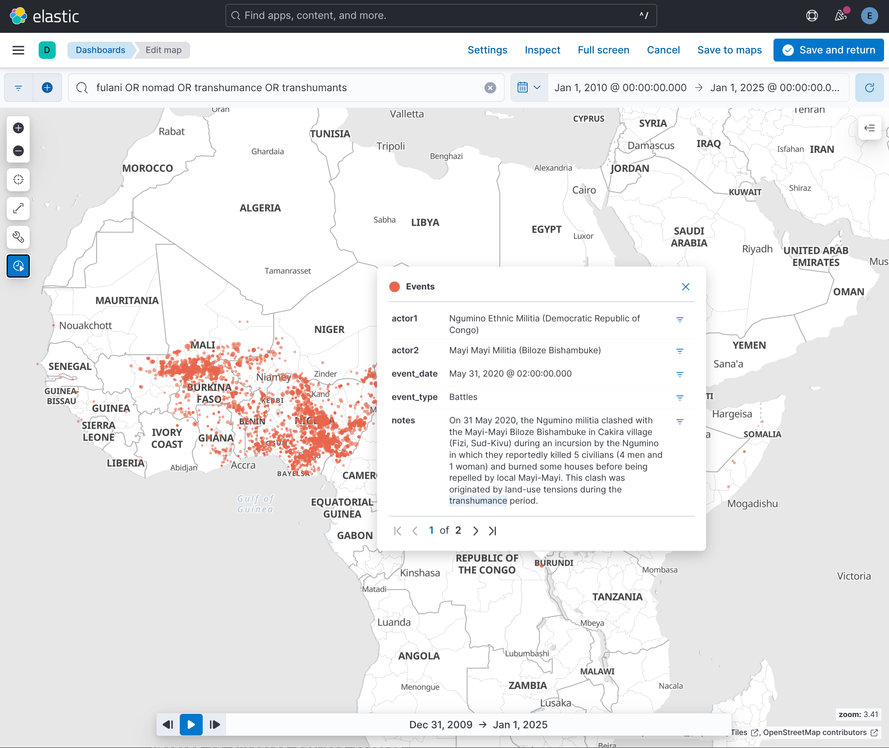

# `elastic_acled`

This repository provides functionalities to add time-stamped geo-data on conflict events 
from the [ACLED project](https://acleddata.com/) to a local [Elasticsearch](https://www.elastic.co/) cluster. 
Doing so enables quick interactive data visualisation and data filtering with the [Kibana UI](https://www.elastic.co/kibana). 
For a quick introduction to the Elastic software stack, see [this short IBM talk](https://www.youtube.com/watch?v=ZP0NmfyfsoM). 
Note that users must provide **their own copy of ACLED data**, which is available for download [here](https://acleddata.com/data/). 

 

 

---

*Note: The instructions in this README have been tested on Linux (Ubuntu). If you are using macOS or Windows, 
you may need to adjust individual commands based on your environment.*

## Setting up your Python environment

Use the provided specification file to install a fresh conda environment named `pandas_elastic`:

> conda env create -f ./environment_ubuntu.yml 

## Running Elasticsearch and Kibana with Docker

The instructions below follow [the official tutorial](https://www.elastic.co/guide/en/kibana/current/docker.html) on how 
to start a local single-node cluster.

Open a fresh console (Console #1): 

1. Define variables:
> ES_VERSION=8.17.3

> ES_IMAGE=docker.elastic.co/elasticsearch/elasticsearch:$ES_VERSION

2. Create a new docker network for Elasticsearch and Kibana:

> docker network create elastic
 
3. Pull the correct Elasticsearch docker image and start a container:
 
> docker pull $ES_IMAGE 

> docker run --name es01 --net elastic -p 9200:9200 -it -m 2GB $ES_IMAGE

If the container spins up correctly, you should be shown a **password** for the default 'elastic' user, as well
as a long **enrollment token** for Kibana. We will need both of these credentials in a moment.

Open another fresh console (Console #2): 

4. Define variables:

> ES_VERSION=8.17.3

> KIBANA_IMAGE=docker.elastic.co/kibana/kibana:$ES_VERSION
 
5. Pull the correct Kibana docker image and start a container:

> docker pull $KIBANA_IMAGE

> docker run --name kib01 --net elastic -p 5601:5601 $KIBANA_IMAGE

If the Kibana container spins up correctly, you should be shown a **localhost link** "to get started". Open that link 
in your web-browser and then follow the instructions shown. This will involve two steps: 

* copying the enrollment token from Console #1 to configure Kibana
* logging into the UI as the 'elastic' user with the password from Console #1.

You now have an Elasticsearch (ES) instance ready to receive data (see below), as well as a configured 
Kibana instance ready to visualise said data.   

## Adding conflict data to Elasticsearch

To add time-stamped geo-data on reported conflict events to ES, open yet another fresh console (Console 3#).

1. Activate the conda environment (see above):

> conda activate geo_elastic

2. Run the Jupyter notebook `Index_event_data.ipynb` provided in this repository. 
Within the notebook, you will again be asked to provide the password for the 'elastic' user from Console #1.

## Importing front-end settings for a simple map dashboard 

Kibana allows you to import front-end settings from previous sessions. This repository includes
the file `data/kibana_objects.ndjson`, which contains settings for a simple interactive map dashboard. 
Proceed as follows to import these settings: 

* Open the UI sidebar
* Open "Management >> Stack Management"
* Open "Kibana >> Saved Objects"
* Click "Import" and select the `data/kibana_objects.ndjson` file.

A map dashboard called "ACLED Dashboard" should now be available.

If you first open that dashboard, you may be shown an empty map. If so, check the time filter in the top right corner. 
Kibana may have selected a time filter for which no event data is available. 

## Working with ES/Kibana containers   

### Stopping and re-starting containers

The two `docker run` commands executed above both use the `-it` flags, which starts the ES and Kibana containers 
in interactive mode within a terminal session. As with any other terminal process, you can simply use 
`CTRL + C` to terminate.

To check the status of all containers on your system, use:

> docker ps -a

To re-start the two stopped containers: 

> docker start es01

> docker start kib01
 
Then open http://localhost:5601/ to log back into the Kibana UI.

**Note:** The above commends do *not* use interactive mode. You can stop the two re-started containers as follows:

> docker stop es01

> docker stop kib01

### Data persistence

Stopping and starting the ES and Kibana containers should not change any of the conflict-event data you have added 
to Elasticsearch. It also should not change any of the work (e.g., dashboards) you have saved from within the 
Kibana UI. However, all data will be lost if you remove (=delete) the two docker containers.

### Resetting the 'elastic' login password and Kibana enrollment token

If you forget the 'elastic' user password or encounter login issues, you can reset it with the following command:

> docker exec -it es01 /usr/share/elasticsearch/bin/elasticsearch-reset-password -u elastic

Similarly, you can regenerate the Kibana enrollment token:

> docker exec -it es01 /usr/share/elasticsearch/bin/elasticsearch-create-enrollment-token -s kibana

### Removing stopped containers

If you no longer need the containers, you can delete them:

> sudo docker remove es01

> sudo docker remove kib01

### Troubleshooting
* **Exit Code #78:** If your attempt to spin up an Elasticsearch container crashes with a cryptic exit code #78, 
it may be related to this issue: https://github.com/laradock/laradock/issues/1699. 
 

* **Kibana shows an empty map/dashboard**: Check that the time filter in Kibana is set to a time range for which 
you have actually provided conflict-event records. 
 

* **Docker permission issues**: Make sure Docker is correctly installed, and you have the necessary permissions 
to execute docker commands.
